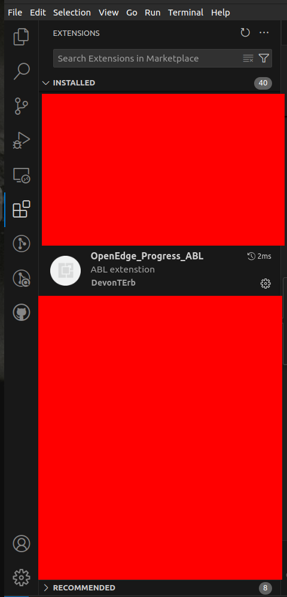

# ProgressABL_Code README

This is going to be a extension for Progress ABL/4GL OpenEdge ABL https://www.progress.com/openedge/features/abl

## Features

1. **Syntax Highlighting**
   - **Examples**: OpenEdge ABL by Camicas Christophe
   - **File Types**: `.p`, `.cls`, `.i`, `.v`, `.w`

2. **Format Document**
   - **Purpose**: Automatically formats the document to improve readability and maintain consistent styling.

3. **IntelliSense**
   - **Features**: Autocompletes variables, fields, methods, etc.

4. **Database Tables**
   - **Source**: Schema files, `.df` files
   - **Features**: Provides temp-tables, buffers, classes, and procedures

5. **Go to Definition**
   - **Examples**: OpenEdge ABL (Progress 4GL) by Ezequiel Gandolfi
   - **Functionality**: Navigate to definitions of classes, procedures, and included files

6. **Snippets**
   - **Purpose**: Provides code completions for basic constructs like `for each`, based on indexes.

7. **Debugger**
   - **Examples**: OpenEdge ABL by Riverside Software
   - **Functionality**: Debugging features for code execution (Note: Uncertain if this will work in your setup)


## Requirements

VS Code

## Setup Instructions

### Step 1: Copy the ABL Folder

To integrate Progress ABL support into VS Code, you need to copy the `abl` folder containing your ABL code and extensions into the appropriate VS Code extensions directory for your operating system.

#### Windows

1. Open File Explorer.
2. Navigate to `%USERPROFILE%\.vscode\extensions`.
3. Copy the `abl` folder into this directory.

#### macOS

1. Open Terminal.
2. Run the command: 
    ```bash
    cp -r /path/to/abl ~/.vscode/extensions/
    ```

#### Linux

1. Open Terminal.
2. Run the command:
    ```bash
    cp -r /path/to/abl ~/.vscode/extensions/
    ```

### Step 2: Verify Installation

1. Open Visual Studio Code.
2. Go to the Extensions view by clicking on the Extensions icon in the Activity Bar on the side of the window or pressing `Ctrl+Shift+X`.
3. Search for your Progress ABL extension to ensure it appears in the list and is enabled.

### Step 3: Open and Edit ABL Files

1. Open your ABL files within VS Code.
2. Use the features provided by the extension, such as syntax highlighting, code snippets, and IntelliSense.




## Extension Settings

Include if your extension adds any VS Code settings through the `contributes.configuration` extension point.

For example:

This extension contributes the following settings:

* `myExtension.enable`: Enable/disable this extension.
* `myExtension.thing`: Set to `blah` to do something.

## Known Issues

Calling out known issues can help limit users opening duplicate issues against your extension.

## Release Notes

Users appreciate release notes as you update your extension.

### 0.4.2.0
Nothing yet will be updated
---

## Working with Markdown

You can author your README using Visual Studio Code.  Here are some useful editor keyboard shortcuts:

* Split the editor (`Cmd+\` on macOS or `Ctrl+\` on Windows and Linux)
* Toggle preview (`Shift+Cmd+V` on macOS or `Shift+Ctrl+V` on Windows and Linux)
* Press `Ctrl+Space` (Windows, Linux, macOS) to see a list of Markdown snippets

## For more information

* [Visual Studio Code's Markdown Support](http://code.visualstudio.com/docs/languages/markdown)
* [Markdown Syntax Reference](https://help.github.com/articles/markdown-basics/)

**Enjoy!**
